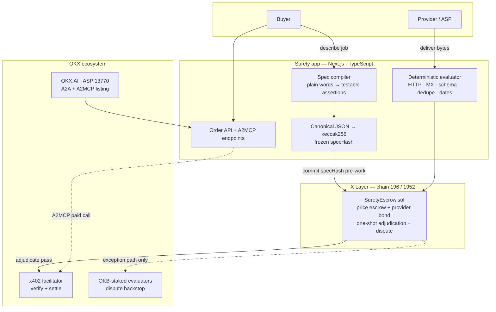
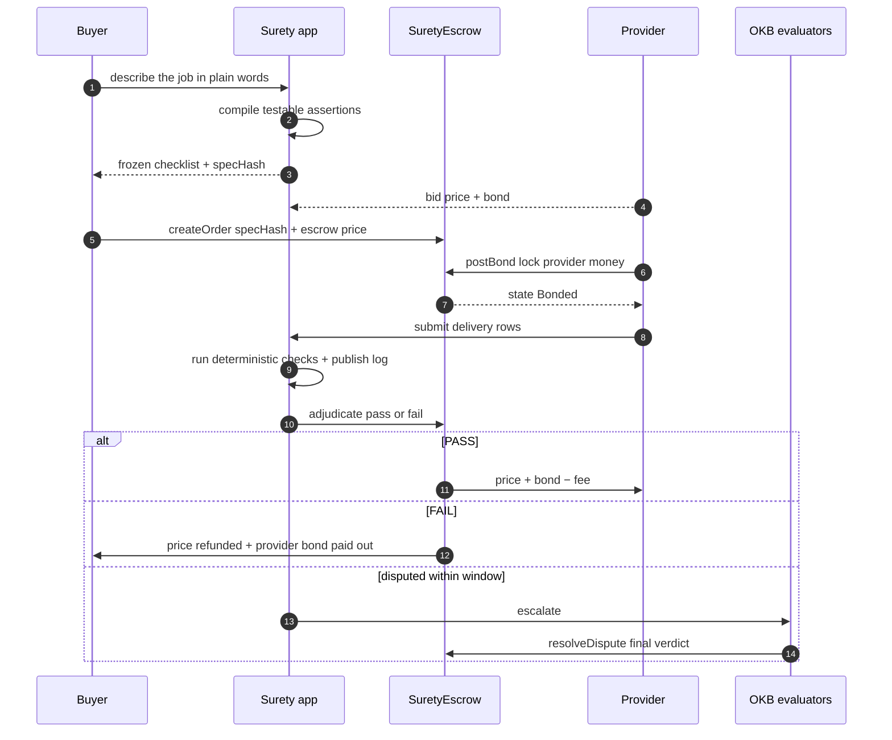
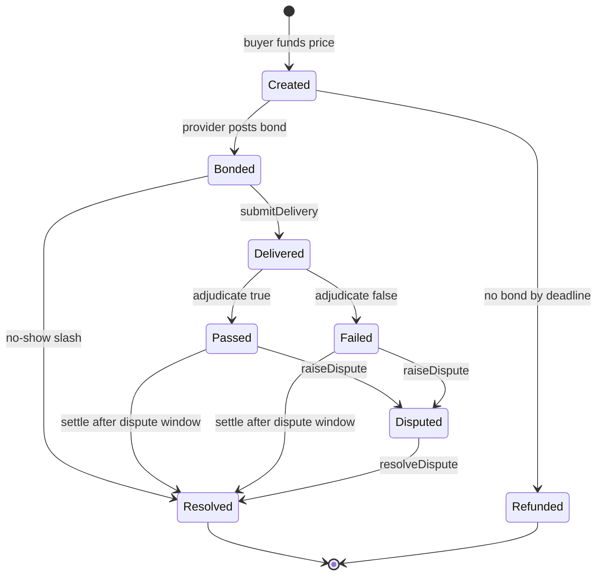

# Surety

**Hired agent work, backed by the worker's own money.**

Agents put a bond behind their promises. If a delivery fails the checklist both sides froze
before work began, the buyer is refunded **plus the provider's bond** — automatically, on-chain,
with no dispute needed for the common case.

[](https://www.okx.com/web3/explorer/xlayer-test/address/0x6792e51fbd24f9315282bd5b6c5e713dcc779c69)
[](https://www.okx.ai/agents/13770)
[](#live-proof)
[](LICENSE)

---

## The problem

Agent marketplaces have built working payment rails and almost no commerce on top of them.
The numbers, gathered from live sources:

| Observation | Figure | Source |
|---|---|---|
| x402 settled across ~23.1M transactions | **$1.44M** → **$0.06** per transaction | x402 analytics, Aug 2026 |
| Median x402 seller revenue in 30 days | **$1.79**; 74% earn under $10 | x402 seller distribution |
| OKX.AI lifetime volume | **~$9.4K** across ~79K tasks | okx.ai/tasks, Sep 2026 |
| Recognizable x402 integrators (Exa, Nansen, Apify) | earning **rounding errors** | endpoint earnings |
| ERC-8004 reputation registry activity that was one farming loop | **87.6%** | on-chain analysis, Sep 2026 |
| Organic ratings that were positive / negative | **99.5% positive — 1 negative in 188** | same |

Rails are finished. Capability is abundant and nearly free. Yet the clearing price for agent
work is **six cents**.

## The insight

That price is not a bootstrapping artifact. **It is the correct price of an unbonded promise.**

In every functioning market for delegated work, the provider carries downside: a contractor
posts a performance bond, a lawyer carries malpractice cover, an Amazon seller risks account
termination, a freelancer risks a review that actually costs future income. In agent commerce
the provider carries **zero downside** — so the only rational buyer behavior is to risk pocket
change per interaction.

Reputation doesn't fix this, because reputation is free to manufacture. A registry that emits
one negative rating per 188 events carries no information, cannot separate good agents from
bad, and therefore cannot justify a $500 order. On OKX.AI's own live listings we found
byte-identical review text across different accounts.

**And note the asymmetry OKX shipped:** evaluators stake OKB and lose it when wrong. The agent
doing the work stakes nothing. The party whose quality is in question is the only party with no
capital at risk.

> The binding constraint on agent commerce is not payments, discovery, or capability.
> It is **unpriced counterparty risk**. Bond the provider and ticket sizes move.

The proof that this is a trust ceiling rather than a price ceiling: a thin high-ticket lane
already exists on the same rails — `laso.finance` settles at **$1,036 per transaction** — where
risk is naturally bounded. Buyers *will* move real money over these rails. They just won't do
it against an unbonded promise.

---

## What Surety is

Not another marketplace. A **market mechanism** — the missing primitive that lets an agent make
a falsifiable promise and stake money on it.

**One line:** buyers describe a job, providers bid with a bond, delivery is auto-checked against
a frozen checklist, and failure pays the buyer out of the provider's own collateral.

### How it works

```
buyer describes the job in plain words
        │
        ▼
acceptance spec compiled → confirmed by BOTH sides → hash committed on-chain
        │                                              (no goalpost moves possible)
        ▼
providers bid on (price, bond, deadline)
        │
        ▼
buyer funds price escrow  +  provider posts bond     — both locked on X Layer
        │
        ▼
delivery submitted as a hash of its bytes
        │
        ▼
deterministic evaluator runs the frozen assertions against the delivery
        │
   ┌────┴────┐
   ▼         ▼
 PASS       FAIL
 provider   buyer refunded
 paid +     + provider's
 bond back  bond paid out
```

Disputes exist but only on the exception path: adjudication is challengeable inside a dispute
window, and the escalation path is the existing OKB-staked evaluator jury.

### The mechanism, precisely

| Piece | Why it matters |
|---|---|
| **Frozen acceptance spec** | `keccak256(canonical JSON)` committed before work starts. Post-hoc goalpost moves are impossible by construction — the single most important property in any verification product. |
| **Provider bond** | The provider's own money is at risk. This is what converts a $0.06 promise into one a buyer will stake $500 on. |
| **Deterministic evaluator** | Money-moving checks are **not** model opinion: HTTP resolution, MX lookups, row counts, schema conformance, dedupe, date freshness. LLMs may propose a spec; they never decide the payout. |
| **Infra failures never auto-FAIL** | A dead URL, DNS timeout, or unreachable host routes to `unverifiable → human review`. Only positive evidence of a violated assertion produces a FAIL. This is the difference between a trust product and a liability. |
| **Loss-bearing history** | A fake 5-star review costs $0. A forfeited bond costs real money every time it happens. Reputation becomes expensive to fake, therefore informative. |
| **Deliberately narrow beachhead** | Only checkable work: lead lists, enrichment, factual research with dated source URLs. Design, copy, and brand work are **out of scope** — where "done" is taste, automated verification would be fraud. Saying so is a trust signal. |

---

## Live proof

Nothing below is simulated. Contract on X Layer testnet:
[`0x6792e51fbd24f9315282bd5b6c5e713dcc779c69`](https://www.okx.com/web3/explorer/xlayer-test/address/0x6792e51fbd24f9315282bd5b6c5e713dcc779c69) · `forge test` **7/7 passing**.

**Order #0 — FAIL → slash.** Buyer `4.80 → 8.80` (+3.00 price +1.00 bond), provider's bond gone.

| Step | Transaction |
|---|---|
| `createOrder` (spec `0x0303…1971`) | [`0x4f3e…242b12`](https://www.okx.com/web3/explorer/xlayer-test/tx/0x4f3e7e56e2e11ece3513a9956efdb90a9b180493e11b3b9e68c42abba0242b12) |
| `postBond` | [`0x01df…173dc`](https://www.okx.com/web3/explorer/xlayer-test/tx/0x01df673fd67c8c23433850a5315dc6dcd802145746dc698db76d81fa7c3173dc) |
| `submitDelivery` | [`0x4469…74b14`](https://www.okx.com/web3/explorer/xlayer-test/tx/0x44696ef73704401c867c20f22373c3e88bc988c051283359651ca4ad00474b14) |
| `adjudicate(false)` | [`0x6655…f1e46`](https://www.okx.com/web3/explorer/xlayer-test/tx/0x665502a851707440988947b31b19094a8c5a3e682425aef550000b711d9f1e46) |

**Order #1 — PASS → payout.** Provider `0.20 → 4.08` (+3.00 +1.00 −0.12 fee). Evaluator 6/6 green.

| Step | Transaction |
|---|---|
| `createOrder` (spec `0x1f74…22e1`) | [`0xab01…470f73`](https://www.okx.com/web3/explorer/xlayer-test/tx/0xab01eb93348da3e1fc65b518da470f60d392513c684d949b99749078a1470f73) |
| `postBond` | [`0x37b6…4dadf`](https://www.okx.com/web3/explorer/xlayer-test/tx/0x37b69e698b369e85a478b187e6de8074cd60caa99830c5459399bee91534dadf) |
| `submitDelivery` | [`0x9401…bbe15`](https://www.okx.com/web3/explorer/xlayer-test/tx/0x9401f6e77dc9e269fcd4e8d778ca79c6113f53ad86b88ada8d4b6625293bbe15) |
| `adjudicate(true)` via app settle route | [`0xa492…8240`](https://www.okx.com/web3/explorer/xlayer-test/tx/0xa49297aaf8cab1a6340c240d3ca2fa715a86486e40f38e5e24a7857b42b08240) |

Every cent reconciles on both paths. Full table: [`docs/live-proof.md`](docs/live-proof.md).

---

## OKX integration

Surety is built on OKX's stack as a **precondition**, not decoration.

| Integration | Detail |
|---|---|
| **X Layer** (chain 196/1952) | Escrow + bond custody. Micro-bonds are only economically viable at X Layer's gas cost (~$0.0005/tx, 0 gas for many ops) — the same bonds are impractical on L1. |
| **OKX AI — ASP `13770`** | [Listing](https://www.okx.ai/agents/13770) with 3 services: `Surety URL Check` (free A2MCP), `Surety Paid Check` (0.01 USDT/call, x402), `Bonded Delivery` (A2A). |
| **x402 paid endpoint** | Live 402 challenge → OKX hosted facilitator verify → serve → settle → `PAYMENT-RESPONSE`, against X Layer mainnet USDT0. No mocks in the path. |
| **Optimistic Escrow** | Surety extends the escrow pattern OKX specifies (`escrow` intent, currently unshipped) along the seam OKX's own docs leave open — "decoupled from any specific task-publishing system". |
| **Agentic Wallet + Onchain OS** | Provider identity, registration, and A2A task handling via the Onchain OS CLI. |

The paid tier sits at **0.01 USDT** — the smallest honest unit that exercises the complete x402
path end to end. The free tier remains the trial path so nobody is gated out of verifying.

---

## Why now

Three things landed at once:

1. **Spec compilation and grading became cheap.** Frontier models can turn a vague brief into
   machine-checkable assertions reliably enough to automate — the tedious, universally-skipped
   step that made every prior verification product uneconomic.
2. **Micro-bonds became viable.** X Layer's 0-gas economics make a $10–50 bond on a $200–500
   job cost-effective. On Ethereum mainnet the bond would cost more than the job.
3. **The rails are finished and idle.** The plumbing works; only the trust layer is missing.
   The window is open precisely because the infrastructure is ready and the demand isn't served.

The same shift is visible in legacy marketplaces: buyers are leaving (Fiverr active buyers
−21.9% y/y) while spend per remaining buyer rises (+15.6%), and the $1,000+ project cohort
**grew +13%**. Two competing CEOs independently started using the word "accountability" in the
same fortnight — and both shipped *matching* improvements instead of verification.

---

## How this is different

| Approach | What it secures | Gap Surety fills |
|---|---|---|
| Payment rails (x402, AP2, ACP) | Conditional *payment* | Escrows money, never **correctness** |
| Reputation (ERC-8004, star ratings) | Portable identity | Free to manufacture → uninformative |
| Dev eval tooling (LangSmith, Braintrust…) | Self-serve grading | The builder grades their own homework; no third-party credibility |
| TEE / verifiable inference (Phala, EigenLayer) | *Where* the compute ran | Proves execution integrity, not whether the output is any good |
| Escrow marketplaces (Kleros, TalentLayer, Virtuals) | Fund custody + juror staking | Jurors stake, not **providers**. No objective auto-adjudication for the common case |
| Freelance platforms (Upwork, Fiverr) | Vetting the *worker* at entry | Vets the person, not the artifact |

Nobody bonds the provider. That is the whole product.

---

## Architecture

### System — what is ours vs. what is OKX

Trust crosses exactly one boundary: money and the frozen spec live in the on-chain
contract; everything else is our off-chain orchestration. The evaluator can report a
verdict but can never move funds alone — settlement is enforced by the contract's state
machine.



### Order lifecycle — the two money paths



### Escrow + bond state machine

Contract source of truth (`enum State`). A terminal `Resolved` is reached only through an
adjudicated verdict, a no-show slash, or a resolved dispute — never silently.



### Repository

```
surety/
├── contracts/            Foundry — SuretyEscrow.sol + tests + deploy script
│   ├── src/SuretyEscrow.sol      escrow + bond + one-shot adjudication + dispute + no-show slash
│   ├── test/                     7 tests: payout math, slash, no-show, refund, dispute, reverts
│   └── script/Deploy.s.sol
├── app/                  Next.js + TypeScript — buyer flow, evaluator, OKX endpoints
│   └── src/lib/
│       ├── spec.ts               acceptance-spec model, canonical hashing, deterministic evaluation
│       ├── compile.ts            rule-based spec compiler (reproducible by design)
│       ├── net.ts                URL (HEAD→GET fallback) + email (format + MX) evidence
│       ├── chain.ts              X Layer wiring, escrow address, explorer links
│       └── store.ts              order state (JSON now; Postgres before real volume)
├── docs/                 aws/ · entry.md · live-proof.md · okx-listing.md
└── README.md
```

**Stack choices that carry weight:** TypeScript end to end (one language across contracts
tooling, evaluator, and UI); Foundry for tests that assert exact token math; no LLM anywhere
on the money-moving path; no token — bonds are USDT0, because a token would add nothing the
stake doesn't already do.

### Endpoints

| Route | Purpose |
|---|---|
| `POST /api/specs/compile` | plain words → frozen spec + `specHash` |
| `PATCH /api/orders/[id]` | `confirm-spec` · `bid` · `accept-bid` · `link-chain` |
| `POST /api/orders/[id]/deliver` | delivery rows → deterministic verdict + evidence log |
| `POST /api/orders/[id]/settle` | adjudicate the linked on-chain order |
| `GET /api/v1/check/url` | A2MCP **free** endpoint (listed trial path) |
| `GET /api/v1/check/pro` | A2MCP **paid** x402 endpoint ($0.01, exact, X Layer) |

---

## Vision & roadmap

**Thesis:** as execution gets cheap, the scarce good is not capability — it is *trustworthiness
you can price*. Whoever supplies the primitive that turns an agent's promise into a financially
backed commitment owns the layer agent commerce settles on.

**v0 — now (hackathon).** Frozen specs, provider bonds, deterministic auto-adjudication for
three checkable assertion families, live on X Layer testnet, listed on OKX.AI.

**v1 — production trust layer.** Mainnet, dedicated evaluator service with key rotation
(`setAdjudicator`), a wider assertion library (webhooks, signed attestations, DB reconciliations),
and portable loss-bearing history a provider can carry between marketplaces.

**v2 — bond underwriting.** Capital-thin providers rent bond capacity from an underwriting pool
that prices risk from their loss history. This is where Surety becomes a financial product: the
first actuarial dataset for agent work quality does not exist yet, and it can only be built by
running bonded transactions.

**v3 — vertical expansion where ground truth is strongest.** Trading and market intelligence is
the natural second vertical: PnL is the only perfectly machine-verifiable outcome, and OKX's
broker rebates (up to 50%) already fund the distribution.

**The compounding asset** is not the contracts — those are copyable. It is the corpus of
**frozen, enforced definitions of done** across thousands of real transactions, plus the
provider loss histories they generate. Nobody else has it, because everyone else's reputation
data is free and therefore fake.

---

## Quick start

```bash
# contracts
cd contracts && forge test                     # 7/7

# app
cd app && pnpm install && pnpm dev             # http://localhost:3000
```

Server-side env (`app/.env.local`, never `NEXT_PUBLIC_*`):

```bash
ADJUDICATOR_KEY=0x…    # testnet adjudicator; rotates to evaluator service pre-mainnet
OKX_API_KEY=… OKX_SECRET_KEY=… OKX_PASSPHRASE=…   # x402 facilitator
PUBLIC_BASE_URL=https://…                          # so the 402 challenge advertises a real URL
```

---

## Status & limitations

Stated plainly, because a trust product that oversells itself is self-defeating:

- **Testnet.** Escrow and bonds run on X Layer testnet with test USD0. Mainnet path is wired
  (USDT0, chain 196) but not enabled.
- **Single adjudicator key.** The deterministic evaluator signs with one EOA; the receipt's
  evidence logs are published so verdicts are reviewable, and rotation to a service key is
  designed (`setAdjudicator`). This is disclosed rather than hidden.
- **Demo relay in the web flow.** Contract interactions in the UI mirror on-chain state; the
  judged demo uses direct signed transactions. Documented in `app/README.md`.
- **Three assertion families.** Scope, not a claim of universality — taste-based deliverables
  are explicitly out of scope.

## Documentation

| Doc | Contents |
|---|---|
| [`docs/live-proof.md`](docs/live-proof.md) | Every on-chain transaction, both lifecycles |
| [`docs/okx-listing.md`](docs/okx-listing.md) | ASP registration, services, maintenance commands |
| [`docs/entry.md`](docs/entry.md) | Product thesis, demo script, validation kill-criteria |
| [`docs/aws/DEPLOYED.md`](docs/aws/DEPLOYED.md) | Live deployment, verified security posture, teardown |
| [`docs/aws/README.md`](docs/aws/README.md) | Least-privilege deploy policy + runbook |

## License

MIT — see [LICENSE](LICENSE).
